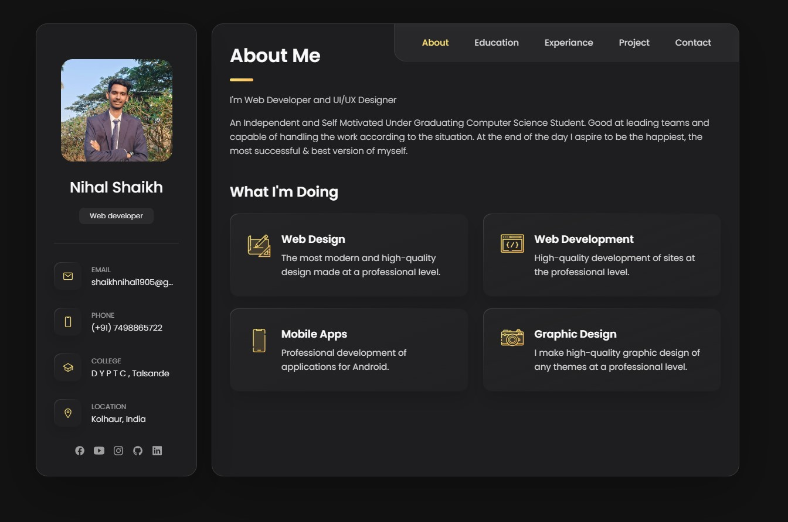

# Personal Portfolio Website

Welcome to my personal portfolio website! This website is a collection of my skills, projects, and experiences. I'm Nihal Shaikh, a CSE Student with a passion for Web Designing. I'm always learning new things and I'm excited to share my knowledge and experience with you.

## On this website, you will find:

* A portfolio of my work
* A Project which I have done before 
* Education and Experience Details

## Technologies Used

This website is built using the following technologies:

* HTML
* CSS
* JavaScript

## Getting Started

open the website in your default web browser.

## Contributing

I welcome contributions to this project! If you would like to contribute, please create a pull request.

## License

This project is licensed under the MIT License.

